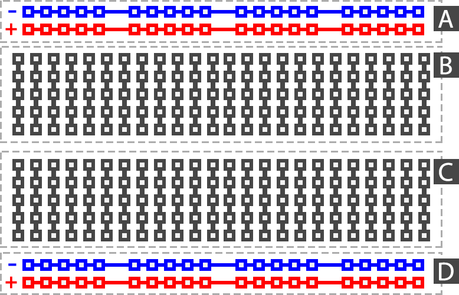

# Les 1: Knipper
In deze les ga je leren om een LED-lampje aan te sturen met een Arduino. Een Arduino is een hele kleine computer die je kunt gebruiken
om elektronica aan te sturen. Je doet dit door in de Arduino IDE (IDE betekent Integrated Development Environment, dat betekent eigenlijk
gewoon simpele programmeer omgeving) een programma te schrijven. Dat programma upload je dan via je computer naar de Arduino. Als je dat 
gedaan hebt staat het programma op de chip van de Arduino. Zodra de Arduino stroom krijgt (bijv. van de USB-kabel of een batterij) gaat 
hij dat programma uitvoeren.

Je eerste programma laat een LED-lampje knipperen. Het .ino bestand dat je hiervoor nodig hebt staat in dezelfde map als dit bestand.

## Aansluiten
__De spanning die een Arduino gebruikt is niet gevaarlijk, hier hoef je dus niet bang voor te zijn. Je krijgt geen schok als je iets aanraakt.__

#### Stap 1:
Je gaat het lampje aansluiten op de Arduino en om dat te doen gebruik je een breadboard. Om dit goed te kunnen doen is het belangrijk dat je snapt hoe een breadboard werkt. Dit kun je op het plaatje hieronder zien.

#### Stap 2: 
Steek het lampje in het breadbord en sluit hem aan zoals hieronder te zien is. Het is heel belangrijk dat je de weerstand ook  aansluit. Waarom leer je bij Natuurkunde. (Hint: niet zonder proberen, de stroomsterkte wordt als je pech hebt zo groot dat de LED smelt en verbrandt.)

#### Stap 3: 
Sluit de Arduino via de USB-kabel aan op de computer. **Belangrijk: Als de grote chip op de Arduino erg warm wordt moet je de USB-kabel direct uit de computer halen. Je hebt dan kortsluiting gemaakt, check goed of je alle draadjes juist hebt aangesloten.**

#### Stap 4: 
Open de Arduino IDE en download en open het .ino bestand dat bij deze les hoort. (Dat kun je vinden in deze map.)

#### Stap 5: 
Druk bovenaan het venster op de upload knop en wacht tot "upload voltooid" rechts onder verschijnt. Je hebt nu het programma op de Arduino gezet. Omdat de Arduino stroom krijgt via de USB-poort van de computer zal hij het programma direct uitvoeren. Als je het goed hebt gedaan zal de LED gaan knipperen.

#### Stap 6:
Volg de instructies die als commentaar in het .ino bestand staan. Commentaar kun je herkennen aan de // die voor elke regel staan en de grijze kleur. Commentaar wordt niet op de Arduino gezet door het programma. Commentaar dat meerdere regels lang is kun je herkennen aan /* bij het begin en */ aan het eind. 
